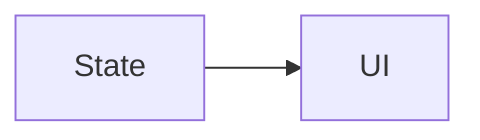

## Activity
---
- Is een UI met één taak, m.a.w. een venster in een applicatie.
## Declarative UI
---
- State bepaald de UI
	- UI beschrijven met functies
	- Hoe ziet de UI eruit voor een bepaalde toestand (state)
- Aangepast state => nieuwe UI


### Compose & re-compose
- UI bestaat uit componenten, ook wel [[#Composable]] genoemd
- Recompose
	- Wanneer de state verandert, update de UI a.d.h.v. functies
	- Kotlin is slim genoeg om enkel de zaken die veranderen te updaten
## Composable
---
- Is een functie/component
- Bevat geen toestandsinfo
	- Wordt uit [[#Bronnen & resources]] (bv.: **R.drawable.imageA**) gehaald
- Werkt met een single source of truth (data)
	- data wordt wel gebruikt binnen het component (bv.: een titelnaam die bovenaan de component wordt getoond)

```kotlin
@Composable 
fun GreetingButton() { 
	val context = LocalContext.current Button( onClick = { 
			Toast.makeText(context, "Hello, World!", Toast.LENGTH_SHORT).show();
		},
		modifier = Modifier.padding(16.dp) ) { 
			Text("Click Me");
		}
	}
}
```
## Density-independent & scale-independent pixels
---
### dp
- density-independent pixels
- abstracte eenheid die uniforme dimensies voor verschillende schermen ondersteund
- Vooral voor UI-elementen
### sp
- scale-independent pixels
- aangewezen voor fonts (bv.: een toestel met grotere fonts zal in app ook groter getoond worden)
## Variable types
---
- Om 2 objecten met elkaar te vergelijken gebruik je in Kotlin `a === b` of **3x een '='**
- om 2 waarden met elkaar te vergelijken gebruik je in Kotlin a == b of **2x een '='**

```kotlin
val a = Person(1);
val b = Person(1);

a == b; // true, since both were passed value 1 which is assigned somewhere & returned
a === b; // false, since a & b are not the same object
```
### Val
- Final variable
### Var
- Mutable variable
### Boolean
- bool -type (is an object in Kotlin though)

Je hebt ook nog String, Int, etc. (all the basics).
## Data structuren
---
In Kotlin worden arrays & lijsten anders aangetoond dan in Java.
### Array
```kotlin
val values : Array<String> = arrayOf("abc","def");
val empty : Array<Double> = emptyArray();
```
### Lijsten
```kotlin
val values = listOf("abc", "def");
val mutableValues = mutableListOf("abc","def");
```
### Map
```kotlin
val values = mapOf(
	1 to "abc",
	2 to "def"
);
val mutableValues = mutableMapOf<>()
```
### Singleton
```kotlin
// als iets als object wordt gedeclareerd, is het automatisch een singleton object
object singletonFactory {
	...
}
```
## Lussen
---
### Range
```kotlin
for(i in 1..10) {
	println("number: $i");
};

for(i in 'a'..'z') {
	println("$i");
}
```
### Array
```kotlin
for((index,element) in array.withIndex()) {
	println("array[$index] = $element")
};
```
### Map
```kotlin
for((index,element) in map) {
	println("map[$key] = $value")
};
```
## Bronnen & resources
---
- Bevat bronnen die je applicatie gebruikt maar niet deel uitmaken van de code:
	- Animaties
	- Kleuren
	- Drawables
		- Afbeeldingen
		- Videos
	- Strings
		- Menu
		- Vertalingen
### Voordelen
- Aanpassen van de UI zonder te updated of her-compileren
- **Lokalisatie**:
	- Verschillende talen
### Hoe?
- Groeperen per **type**
- Groeperen per **configuratie**
- in de map **res/**

```kotlin
val value = stringResource(R.string.myCustomName);
```
### Afbeeldingen tonen
- Gebruik de Coil -library, zie cursus p.: 64
	- Vergeet niet **LAZY LOADING**
- Is een library dus ga ervan uit dit niet relevant is voor de theorie
