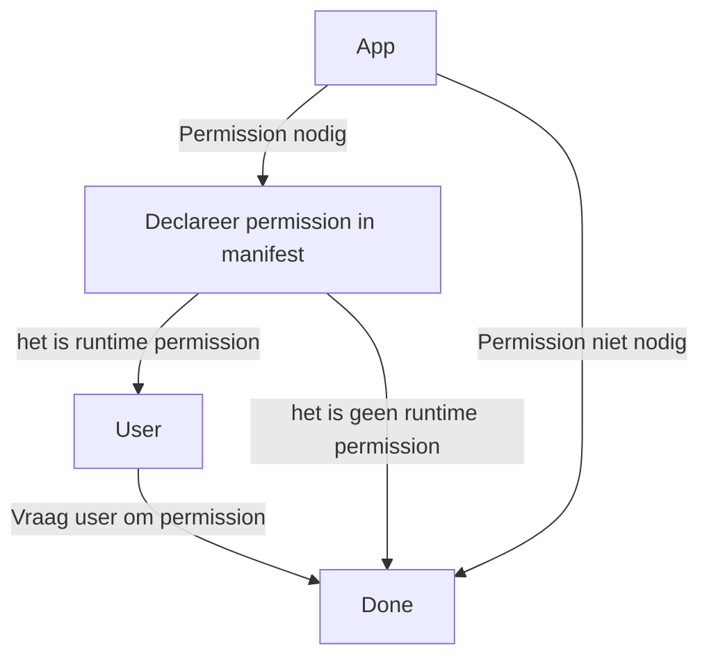

## Interface
- bevat `@GET` om aan te geven dit een GET-functie is
- bevat `suspend fun` om aan te geven dit een async-request is
## JSON to Kotlin
- bevat `@Serializable` om aan te geven van JSON to Kotlin-object te kunnen
- bevat eventueel `@SerialName(value = "JSONeigenschapNaam")` om aan te geven wat de eigenschap naam van het element dat we willen is
## GET & ViewModel
Als we in ons ViewModel een request uitsturen, willen we indien het ViewModel ondertussen verdwijnt ook de coroutine waarin we de request maken stopzetten.
- Gebruik `viewModelScope.launch { ... }` om zoals `launch { ... }` te werk te gaan, maar stop de coroutine(s) als onze ViewModel verdwijnt
## Permissions
Om GET-requests uit te voeren, hebben we internet nodig, om internet toegang te krijgen moeten we permissie vragen van het systeem.

### Permission niveaus
#### Normaal
- Toestemming wordt gegeven bij installatie
- Bluetooth, Internet, etc.
#### Signature
- Toestemming wordt gegeven bij installatie
#### Gevaarlijk
- Toestemming wordt gegeven at runtime
- Camera, accounts, bellen, etc.