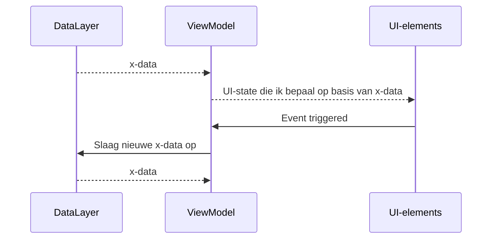

## Architecturale principes
Welk zijn de standaard principes bij het ontwikkelen van mobiele applicaties.
>[!to-know]
>- **Separation of concerns**
>- **Declarative UI**
>- **Single source of truth**
>- **Unidirectional flow**
## ViewModel
Het ViewModel staat centraal in de applicatie:
- Het haalt data uit de **data layer**
- Het bepaald adhv de data een **UI-state**, en stelt deze ter beschikking aan de UI-elementen
	- De UI **observed** het ViewModel om updates te ontvangen bij wijziging van de UI-state
- De UI-elementen sturen events naar het viewmodel, die dan opnieuw de UI-state gaat bepalen
![[Pasted image 20240605175054.png]]
### Voorbeeld: ViewModel
```kotlin
class viewModel : ViewModel() {
	// GameUIState() is een object dat data bevat (onze data layer)
	// _uiState kan door ons viewmodel aangepast worden (type: MUTABLEstateflow)
	// _uiState is private, UI kan dus NIET aan de _uiState
	private val _uiState = MutableStateFlow(GameUIState());

	// uiState bevat _uiState maar is van het type StateFlow & dus niet MUTABLEstateflow
	// uiState is onaanpasbaar maar WEL observeerbaar door de UI
	val uiState: StateFlow<GameUIState> = _uiState.asStateFlow();
}
```
#### StateFlow\<T>
Observeert één of meerdere waardes & notified de observers dat de state veranderd.
- Bevat zelf dus geen waardes maar observeert objecten met waardes
- Verwittigd observers
#### MutableState\<T>
Observable object dat waardes bevat & een re-composition van de betrokken componenten.
- Bevat dus zelf waardes
- Trigger een re-compose van betrokken objecten

>[!to-know]
>- StateFlow gebruikt update functie om "notify" aan observers te sturen
>- MutableState gebruiken om waarde aan te passen
## UI
Het viewmodel bevat [[#UI-state]] & [[#Event handler methodes]] & blijft dus bestaan bij configuratiewijzigingen.

>[!to-know]
>Separation of concerns:
>- Het viewmodel bestaat dus uit twee delen, de [[#UI-state]] die de [[#UI]] bepaald.
>- Beter testbaar
>- Robuuster
>- Beter wanneer men met teams werkt
### Voorbeeld: UI layer
```kotlin
class MainActivity {
	@Composable
	fun Main(gameViewModel: GameViewModel = viewModel()) {
		// collectAsState, observeer ViewModel() & trigger re-compose bij update
		val gameUIState by gameViewModel.uiState.collectAsState();
		
		if(gameUIState.x)
			AskQuestion();
		else
			responseQuestion();
	}

	@Composable
	fun AskQuestion() {
		// ...
	}

	@Composable
	fun responseQuestion() {
		// ...
	}
}
```
### UI-state
De UI-state bevat:
- MutableState eigenschappen (variabelen)
- StateFlow eigenschappen (aanpassen met update)
- ViewModel bepaald de UI-state

>[!to-know]
>Single source of truth:
>- Het is enkel de UI-state die de UI bepaald.
### UI-elements
De UI is zeer abstract & bevat:
- Informatie & methodes om de status te tonen
	- StateFlow (CollectAsState)
- Event handlers die gekoppeld zijn aan objecten
	- De Event handlers roepen methodes op uit het [[#ViewModel]]

>[!to-know]
>Unidirectional dataflow:
>- De UI gaat niet zelf de data aanpassen, maar geeft events door aan de [[#UI-state]] die de data eventueel kan wijzigen.
## Data layer
De data layer heeft 2 verantwoordelijkheden:
- Het **beschikbaar stellen van data** aan het [[#ViewModel]]
- Het **opslagen van data** gepresenteerd door het [[#ViewModel]]
### Voorbeeld: data layer
Een klasse wordData.kt bevat data omtrent een quiz.
```kotlin
class wordData {
	val quiz : Set<String> = setOf() {
		"x",
		"y",
		"z"
	}
}
```


