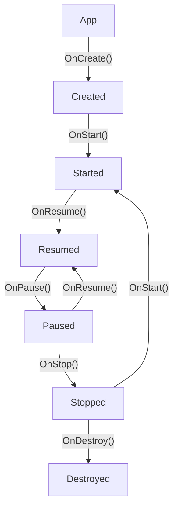
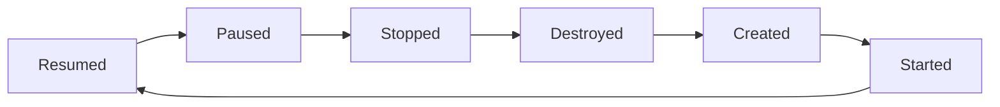

## Activiteit toestanden
Een activiteit kan zich in verschillende toestanden bevinden, het doel is om ervoor te zorgen dat een applicatie zo weinig mogelijk resources gebruikt, maar tegelijk ook zo snel & goed werkt, aan de hand van de toestanden zoekt men hier een balans tussen.

![[InstanceStates.png]]
## Wanneer welke status?
Er zijn twee belangrijke statussen voor elks van de status toestanden, namelijk **zichtbaar** & **focus**.

Een applicatie kan **zichtbaar** zijn, maar niet in focus (denk aan meerdere vensters waarbij de applicaties zichtbaar zijn, maar een andere applicatie de focus heeft).

Een applicatie heeft **focus** wanneer deze actief op het venster gebruikt wordt (het meest logische voorbeeld zijnde een applicatie die het volledig scherm ter beschikking heeft).
### Created
- **Opstartlogica** van de applicatie
- Laad de applicatie, maar de applicatie is **nog niet zichtbaar**
### Started
- Applicatie is **minstens gedeeltelijk zichtbaar**
- Applicatie is dus **nog niet in focus**
### Resumed
- Applicatie is **volledig zichtbaar & heeft de focus**
### Paused
- Activiteit is **zichtbaar maar niet in focus** (bv.: meerdere vensters)
- `OnPause()` wordt opgeroepen **net voor het de focus verliest**
	- Houdt `OnPause()` dus kort aangezien de andere app focus wil en moet wachten tot deze functie klaar is, maak dus geen netwerk calls, database transacties, bewaren van data, etc. **houdt het kort**
### Stopped
- Wanneer de applicatie niet langer zichtbaar is, zelfs niet gedeeltelijk
- Een andere applicatie heeft de zichtbaarheid & focus genomen
- `OnStop()` bevat dus belangrijke methods die ervoor moeten zorgen dat gegevens opgeslagen worden zodat deze niet verloren gaan, m.a.w. we voeren **intensieve operaties** uit.
### Restart
- Eerder een functie dan een status, we komen van [[#Stopped]] & gaan naar [[#Started]]
	- Vaak bij het terugkeren naar de applicatie, bv.: wanneer de applicatie op de achtergrond is geplaatst bij het veranderen naar een andere applicatie.
	- Via de back-knop komen we terug in deze app terecht
	- Via de achtergrond apps kiezen we onze applicatie om terug actief te komen
- `OnRestart()` wordt opgeroepen & onmiddellijk gevolgd door `OnStart()`
### Destroyed
- Het applicatie proces wordt vernietigd, bij `OnDestroy()` is het zware werk al gebeurd (zie [[#Stopped]])
- Vaak wordt deze functie niet overschreven of toch zeer beperkt in functionaliteit behouden
## Rotatie
Bij het roteren van verticaal naar horizontaal & vice-versa, is de layout vaak anders; de levenscyclus in deze operatie maakt dus ook een redelijk extreme levensloop mee:

>[!to-know]
>- Bij schermrotatie veranderd de layout & wordt de app vernietigd & opnieuw aangemaakt
>- Informatie moet opgeslagen worden voor het destroyed wordt
>	- `rememberSaveable()` is hetzelfde als `remember()` maar slaagt de informatie op in een **bundle-object** zodat die nooit wordt verwijderd uit het geheugen

