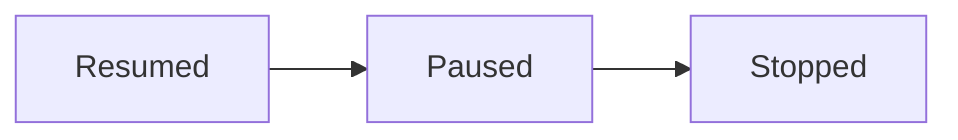
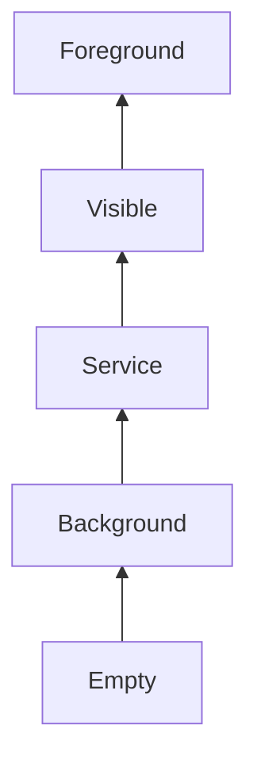
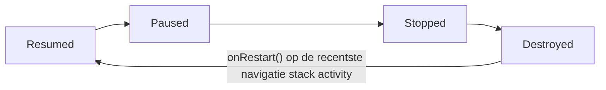

## Activity stack
- LIFO-principe (last in first out)
- Activity stack wordt **NOOIT** herschikt
- Onafhankelijk van applicatie
	- Meerdere applicaties kunnen activities op dezelfde stack plaatsen
- Elke activity (zie [[Basics#Activity]]) wordt geplaatst op de stack als een andere actief komt
	- Binnen een app kunnen meerdere vensters (activities) op de stack geplaatst worden
	- Enkel bij het gebruik van de [[#Back-knop]] werkt het anders
	- De stack activity wordt in status **Stopped** geplaatst

## Taken
- Een taak bevat alle activities van een specifieke applicatie
## Processen
- Het systeem verwijderd processen, geen individuele activities
- Des te hoger in de boom, des te meer prioriteit het proces krijgt
	- Des te kleiner de kans het wordt verwijderd

## Back-knop
- Verwijderd de activity die momenteel actief is
- Restart de activity die zich bovenaan de navigatie stack bevindt

## Routes
- Bepalen welke composables/activities getoond worden

>[!to-know]
>**Routes worden ALTIJD vastgelegd in de NavHost, NIET in de composables**, route methodes kunnen als parameters gegeven worden aan composables die deze dan aan UI-elementen koppelen.
>```kotlin
>NavHost(navController = navController) {
>	composable(route = R.Strings.Routes.Start) {
>		StartScreen(
>			onButtonAClick = {
>				navController.navigate(R.Strings.Routes.ScreenA)
>			}
>		)
>	}
>}
>
>@Composable
>fun StartScreen(onButtonAClick) {
>	Button {
>		onClick=onButtonAClick
>	}
>}
>
>```
## Intents
Met intents kan je acties vragen van een andere applicatie, er zijn drie types:
- Activiteit
	- Start app "abc"
- Service
	- Start een dienst in de achtergrond
- Broadcast
	- Bericht uitsturen die elke applicatie kan ontvangen
## Late runtime binding
**Abstracte** request wordt uitgestuurd zonder te weten welke applicatie deze gaat afhandelen. Vaak krijgt de gebruiker een lijst te zien van applicaties die de request kunnen afhandelen of wordt een standaard app gestart, telkens **at runtime**.